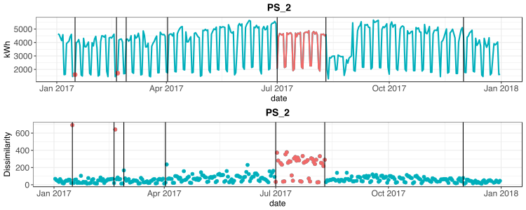

# nre 

***

**nre** is an open-source [R](https://cran.r-project.org/) package that 
provides tools to detect potential non-routine events (NRE), which are characterized  by changes in energy use that are not attributable to installed efficiency measures, and not accounted for in the baseline model’s independent variables. The detection algorithm is based on a statistical change points algorithm, where change points are considered to be the locations in an energy use time series where a change in the statistical properties of the sequence is observed. In addition, in the following example a methodology for adjusting the NREs is presented. For more details about the proposed methods please refer to **Data Driven Methodology for Non-Routine Event Detection and Adjustment**


## Installation

To install **nre** package the user is required to install:
* [R](https://cran.r-project.org/) (version 3.4.2 or later), which is an open source programming language and software environment for statistical computing
* A web browser such as Chrome, Firefox or Safari
* [RStudio](https://www.rstudio.com/), which is an open source integrated development environment (IDE) for R
* [devtools](https://cran.r-project.org/web/packages/devtools/index.html) R package, which is providing R functions that simplify R package installation from github
* [RMV2.0](https://github.com/LBNL-ETA/RMV2.0) R package for performing
advanced measurement and verification 2.0 (M&V 2.0)for Commercial Buildings

Once [R](https://cran.r-project.org/) and [RStudio](https://www.rstudio.com/) are installed, open [RStudio](https://www.rstudio.com/) and install the [devtools](https://cran.r-project.org/web/packages/devtools/index.html)
package by running in the console the following command:
```r
install.packages("devtools")
```
Install the **RMV2.0** package using the following command:
```r
devtools::install_github("LBNL-ETA/RMV2.0")
```
Install the **nre** package using the following command:
```r
devtools::install_github("LBNL-ETA/nre")
```

## Input Data Format
To correctly the calculation within the **RMV2.0** package, it is required from the user to provide a specific format of input data, which are the pre and post period data (note that only pre period are required when screening project is performed). The input data should be loaded as csv files that have a specific tabular format. These files should have at least three columns: 

1. *time*: timestamps of the time series using "*month/day/last two digits of the year*" format (i.e., "%m/%d/%y %H:%M" format)
2. *eload*: energy consumption values 
3. *Temp*: outside air temperature values

Basically the first line of the csv files will look like the following: 
```r
"time","eload","Temp"
"1/1/14 23:00",24.17,52.6
"1/1/14 23:15",24.95,52.1
```
which correspond to the following table:

| time        | eload | Temp |
| ------------|:-----:| ----:|
| 1/1/14 23:00 | 24.17 | 52.6 |
| 1/1/14 23:15 | 24.95 | 52.1 |

Note that the first line of the files should always contain the *time*,*eload* and *Temp* headers and it is letter case sensitive. If more variables are available, it's possible to add them  by adding new columns in the input data files.

The user should avoid in the input data files: 
* Rows with missing values 
* Duplicates in the time column (i.e., timetampes) 

## Example of nre usage:

In this example we are using a simulated hourly energy consumption data generated using EnergyPlus models for a DOE reference buildings: primary school (PS) located in Chicago an increase of the Cooling Equipment Efficiency was implemented. The NREs were defined as an additional class session during the summer vacation period (July 13th to August 7th), and two  US federal holidays that occur in January 16th and February 20th (i.e., Martin Luther King Jr. Holiday and Presidents Day). Note that the user can find the following script and an additional example in the ** Script_Demo.R** file within the demo folder.

### Potential NRE detection

The NRE detection algorithm involves four steps: (1) create a building energy use baseline model using pre-installation data (typically 1 year of data to cover all weather seasons). The baseline model is taken as reflective of the typical behavior of the building; (2) During the post period use the baseline model to generate prediction values representing the energy consumption if the retrofit had not been implemented; (3) For each day of the post period estimate the dissimilarity between the predicted time series and the actual consumption values; (4) Apply change points algorithm to the time series of dissimilarity values.

* Upload pre-retrofit and post-retrofit data:
```r
pre <- read.csv(file="data/PS_2_pre.csv")
post <- read.csv(file="data/PS_2_post.csv")
```

* Generate a baseline model. In this example GBM model from **RMV2.0** has been used:

```r
gbm_res <- RMV2.0::gbm_baseline(train_Data = pre,
                                pred_Data  = post,
                                variables = c("Temp", "tow","vacation"),
                                ncores=4)
```

* Extract the predictions:

```r
post_Data <- dplyr::select(gbm_res$pred,time,eload,Temp)
y_pred <- gbm_res$prediction
predicted_post_Data <- post_Data
predicted_post_Data$eload <- y_pred
```

* Run the NREs detection algorithm:

```r
nre_detected <- nre::nre_detect(post_Data,predicted_post_Data)
```

* Generate visualization of the results

```r
dissim_tab <- nre_detected$dissim_tab
idx_nre <- which(dissim_tab$date > "2017-06-30" & dissim_tab$date < "2017-08-11")
idx_nre_2 <- which(dissim_tab$date == "2017-02-20" | dissim_tab$date == "2017-01-16")
idx_nre <- c(idx_nre_2,idx_nre)
dissim_tab$diss_nre <- NA
dissim_tab$diss_nre[idx_nre] <- dissim_tab$dissimilarity[idx_nre]
post_d <- nre::convert_to_daily(post)
post_d$eload_nre <- NA
post_d$eload_nre[idx_nre] <- post_d$eload[idx_nre]
post_d$eload_nre2 <- NA
post_d$eload_nre2[idx_nre_2] <- post_d$eload[idx_nre_2]
```

<p align="center"></p>

These two plots represent: Daily time series of actual energy consumption  during the post-retrofit period (upper graphic) and time series of the dissimilarity metric (lower graphic). Blue depicts periods of time in which NREs were absent; red a indicate periods of time in which NREs were present.


### NRE Adjustment methodology

The NRE Adjustment methodology follows six steps, some of which can be automated, and some of which must be performed by the M&V practitioner: (1) estimate the locations of potential NREs using the NRE detection algorithm (See the previous section); (2) verify which detected NREs are actual NREs using project information or site inquiry, and validate their actual date of occurrence; (3) exclude from the post period time series the data points from the verified NRE periods; (4) train the regression model using the remaining data of the post period time series; (5) use the trained model to predict what the energy consumption would have been within the NRE periods if no NRE was present; (6) use the model predicted values as replacement data for the periods in which the NRE was present. The final step of the methodology produces the adjusted post period time series. 

* Define the NRE periods (In this example we are using the actual NRE period that were defined in the simulations):

```r
dts <- as.POSIXct(strptime(post$time, format = "%m/%d/%y %H:%M"))
idx_nre_0 <- which(dts >= "2017-06-30 00:00:00" & dts <= "2017-08-11 23:00:00")
idx_nre_0 <- c(idx_nre_0,which(dts >= "2017-02-20 00:00:00" & dts <= "2017-02-20 23:00:00"))
idx_nre_0 <- c(idx_nre_0,which(dts >= "2017-01-16 00:00:00" & dts <= "2017-01-16 23:00:00"))
```

* Exclude the from the post period time series the data points from the defined NRE periods:

```r
post_nre <- post[idx_nre_0,]
post_train <- post[-idx_nre_0,]
```

* Train the regression model using the remaining data of the post period time series:

```r
gbm_res2 <- RMV2.0::gbm_baseline(train_Data = post_train,
                                 pred_Data  = post_nre,
                                 variables = c("Temp", "tow","vacation"),ncores=5)
```

* Produce the adjusted post period time series (*post_adj*) by using the model predicted values as replacement data for the periods in which the NRE was present:

```r
post_adj <- post
post_adj$eload[idx_nre_0] <- gbm_res2$prediction
```
